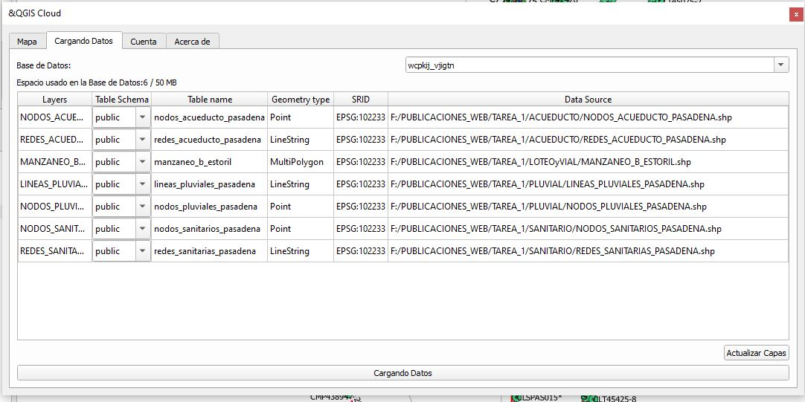
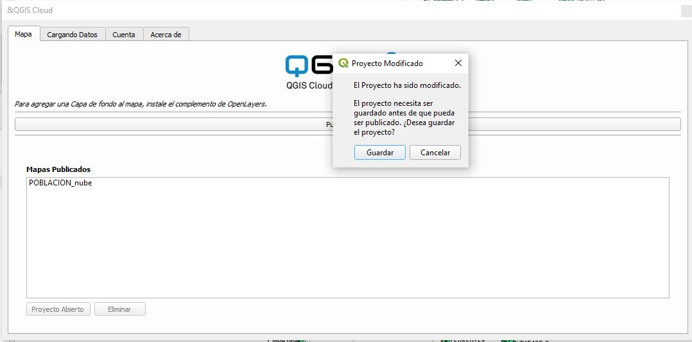
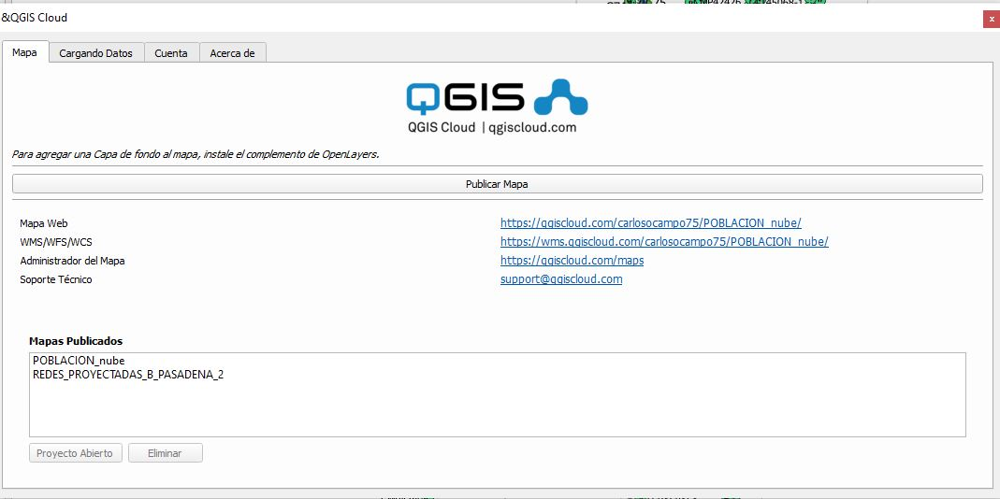
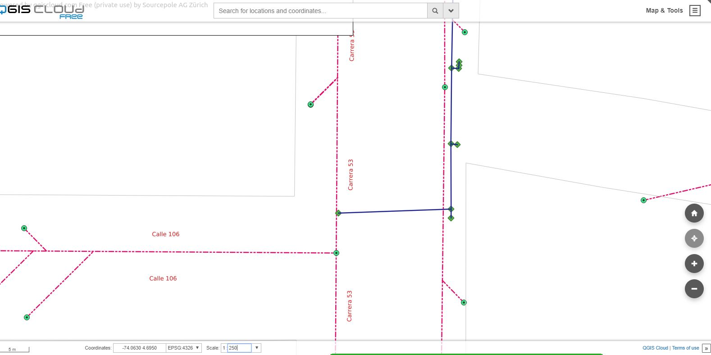

##### TAREA 01: CREACION DE MAPAS TEMATICOS CON QGIS

## MAPA DE REDES DE ACUEDUCTO Y ALCANTARILLADO SANITARIO DISEÑADAS PARA RENOVAR LAS EXISTENTES

*Cuál es el problema a tratar?*

El problema a socializar el cambio de las redes de acueducto y alcantarillado sanitario en el Bario 
Estoril en la localidad de Suba. Esta informacion es el resultado de los diseños realizados por el 
consultor en el año 2017 para la Empresa de Acueducto y  Alcantarillado de Bogota E.A.A.B.

*Por qué un mapa ayuda a resolverlo?*

Esto ayuda  por que con una herramienta visual y sencilla de manejar la comunidad comprenderá
de una manera clara todos los trabajos a realizar en su comunidad.Y asi ayudar a que el proceso constructivo
no cause mayores traumatismos.

*Descripción del mapa temático*

El mapa muestra principalmente las redes que por su edad deberan ser cambiadas o construidas, 
las redes son:

REDES DE ACUEDUCTO
REDES DE ALCANTARILLADO SANITARIO

Los atibutos que se muestran de las redes son El diametro y su material.

Ademas de estas capas se utilizaron las capas de nomenclatura vial y de manzaneo Bajadas de 
la pagina de datos abieros de Mapas Bogotá

Los datos de redes son propios.

El sistema de referencia de coordenadas es el 102233 MAGNA-CIUDAD-BOGOTA

*LINKS PARA USAR EN LA WEB YEN SERVICIOS WMS*

LINK PARA ABRIR MAPA EN LA WEB: https://qgiscloud.com/carlosocampo75/REDES_PROYECTADAS_B_PASADENA_2/

LINK DEL SERVICIO WMS: https://wms.qgiscloud.com/carlosocampo75/REDES_PROYECTADAS_B_PASADENA_2/

#### Pasos para la creacion de un mapa para publicar:

1. CREACION DEL MAPA EN QGIS VERSION 3.4
2. SUBIR INFORMACIÓN QGIS CLOUD

3. GENERACIÓN DE LINKS PARA USO DEL MAPA

4. PUBLICACION DEL MAPA EN LA WEB

